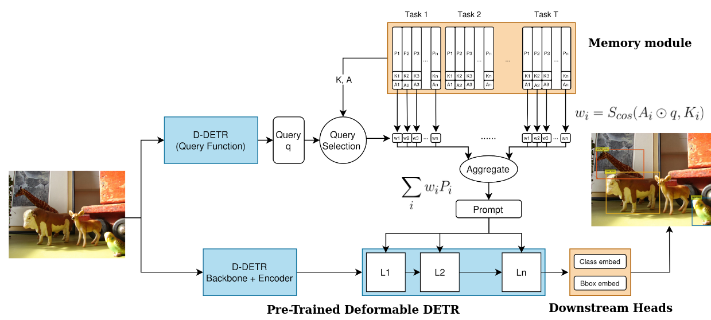
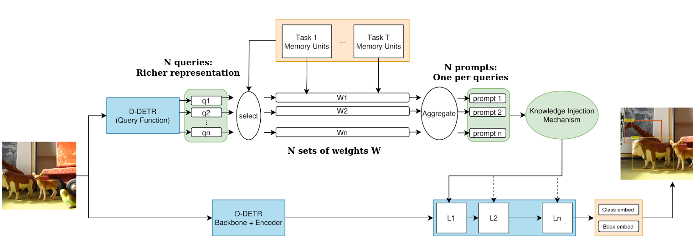
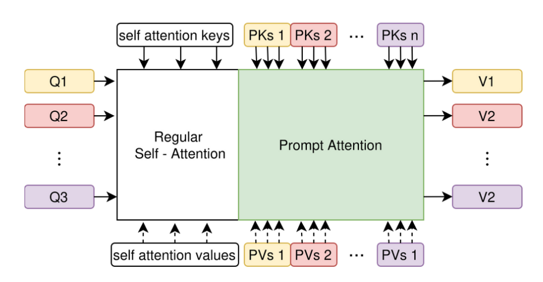
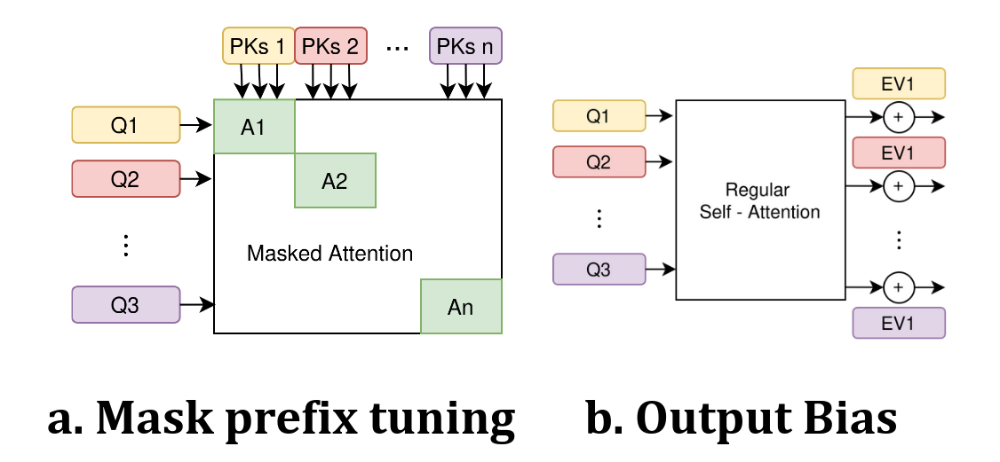
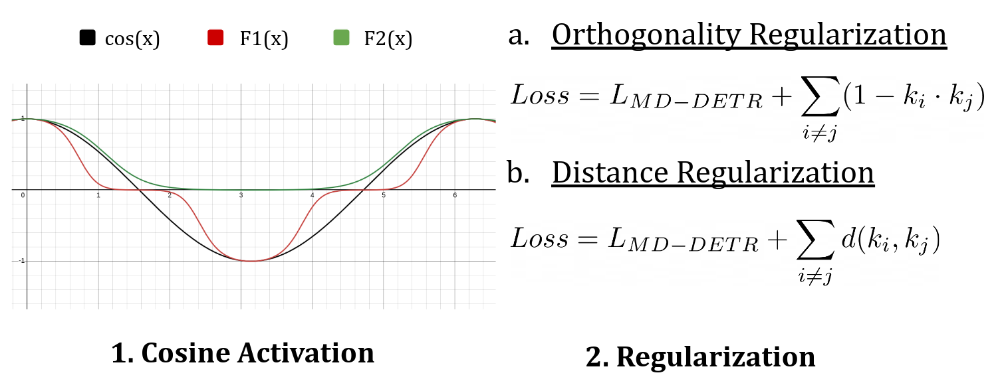
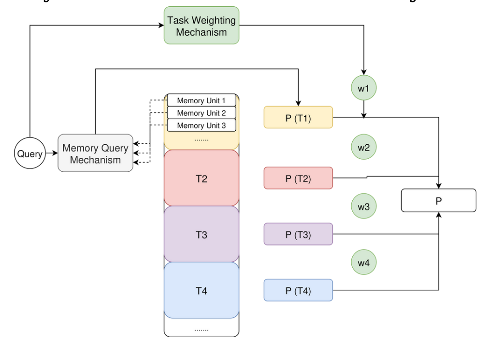

# Proposal-Conditioned Memory for Continual Object Detection
_A Deformable DETR–based, prompt-driven approach to continual object detection (CL-OD)._

**Status:** Work-in-progress research repo  
**Affiliation:** UBC Computer Vision Lab

---

## Overview

We study **continual object detection**—learning a sequence of detection tasks **without** joint access to all past data—where models must adapt to new distributions while **retaining** prior knowledge. We build on **Deformable DETR** and introduce a **proposal-conditioned memory** design:

- Each **object proposal (query token)** issues its own **memory query** (rather than a single image-level query).  
- Retrieved knowledge is transformed into **prompts** and **injected** into the detector to guide decoding.  
- We explore **aggregation** strategies (ALL / OWN / DUAL), a **task-gated** memory prior, and **key regularization** for stable memory selection.

> In preliminary experiments, the proposal-conditioned family improves **early tasks**, with a regression on the **final task** that we are actively investigating (order sensitivity, gating calibration, aggregation schedules).

---

## Past Work and High-Level Architecture

> A unified template covering both prior prompt-based CL detectors (e.g., MD/OMD-DETR) and this work.



*Image → Backbone → Transformer (queries) → Query Function → Memory Bank → Prompt Generator → Prompt Injection → Predictions*

- **Query**: vector that asks the memory for relevant knowledge  
- **Memory Bank**: stored task knowledge (key/value units)  
- **Prompt**: compact, learned conditioning injected into the detector

---

## Key Contributions

- **Proposal-wise memory retrieval**: instance-aligned selection via queries per object proposal.  
- **Prompt-based conditioning**: retrieved knowledge becomes **prompts** that steer decoding.  
- **Aggregation variants**: **ALL** (shared prompts), **OWN** (private per-proposal prompts), **DUAL** (shared + private per layer).  
- **Task-gated memory (hierarchical prior)**: re-weights memory activations by estimated task affinity.  
- **Key regularization**: orthogonality/distance regularizers to encourage unit specialization and stable retrieval.  
- **Dynamic growth**: allow the memory bank to expand when needed (engineering).



*Proposal-wise memory*




*Aggregation strategies*



*Cosine activation and regularization*


*Hierarchical (Task Gated) Memory*

---

## Background (for readers)

- **Object detection**: classify + localize **multiple** objects per image; metric: **mAP@[.5:.95]**.  
- **Continual learning (CL)**: learn tasks **sequentially**; must balance **plasticity** (adapt) and **stability** (retain).  
- **Why CL-OD is hard**: many instances per image, proposal dynamics; forgetting impacts **localization** and **classification**.  
- **DETR / Deformable DETR**: query-based **set prediction** with **sparse multi-scale attention**—a clean interface to inject prompts in CL.

---

## Installation

**Requirements**
- Python ≥ 3.10, PyTorch ≥ 2.2, torchvision (CUDA-matched)
- CUDA 11.8+ (or CPU for inspection), GCC ≥ 9 for deformable ops
- Linux (Ubuntu 20.04/22.04 recommended)

```bash
# clone
git clone https://github.com/collSteve/MD-DETR.git
cd MD-DETR

# environment
conda create -n clod python=3.10 -y
conda activate clod

# install deps
pip install -r requirements.txt
```

---

## New Run:
Run slurm schduler:
```bash
bash launch.sh -e config/experiement/validate_with_no_prompt.env -p config/sbatch/validate.sbatch.env
```
```bash
bash launch.sh -e config/experiement/validate_with_prompt.env -p config/sbatch/validate.sbatch.env
```
```bash
bash launch.sh -e config/experiement/train_with_no_promt.env -p config/sbatch/train.sbatch.env
```
```bash
bash launch.sh -e config/experiement/train_with_promt.env -p config/sbatch/train.sbatch.env
```

Directly run:
```bash
EXP=/h/stevev/MD-DETR/config/experiement/train_with_promt.env
export EXPERIMENT_CONFIG=$EXP

export EXPERIMENT_CONFIG=/h/stevev/MD-DETR/config/experiement/train_with_prompt.yaml
source config/global.env
bash run_mm.sh

nohup python run.py -m sbatch=train_sbatch hydra/launcher=slurm hydra.verbose=true

python run.py -m sbatch=validate_sbatch hydra/launcher=slurm experiment=validate_with_prompt

python run.py -m sbatch=train_sbatch hydra/launcher=slurm hydra.verbose=true

python run.py run.local=true experiment=validate_with_prompt

nohup python run.py -m sbatch=train_sbatch hydra/launcher=slurm &> outputs/submit.log &

nohup python run.py -m experiment=train_with_prompt sbatch=train_sbatch_scavenger hydra/launcher=slurm &> outputs/submit.log &

python run.py run.local=true experiment=validate_with_prompt experiment.checkpoint_dir=/ubc/cs/research/shield/projects/kren04/MD_DETR_runs/upload/checkpoints/Task_1 shared=shield

python run.py run.local=true experiment=train_with_prompt experiment.checkpoint_dir=/ubc/cs/research/shield/projects/kren04/MD_DETR_runs/upload/checkpoints/Task_1 shared=shield

python run.py run.local=true experiment=train_with_prompt experiment.checkpoint_dir=/ubc/cs/research/shield/projects/kren04/MD_DETR_runs/upload/checkpoints/Task_1 shared=shield experiment.start_task=2

python run.py run.local=true experiment=train_with_prompt experiment.checkpoint_dir=/ubc/cs/research/shield/projects/kren04/MD_DETR_runs/upload/checkpoints/Task_1 shared=shield experiment.start_task=1 experiment.n_tasks=2

python run.py run.local=true experiment=train_with_prompt experiment.checkpoint_dir=/ubc/cs/research/shield/projects/kren04/MD_DETR_runs/upload/checkpoints/Task_1 shared=shield experiment.start_task=3 experiment.n_tasks=4

python run.py run.local=true experiment=train_with_prompt experiment.checkpoint_dir=/ubc/cs/research/shield/projects/kren04/MD_DETR_runs/upload/checkpoints/Task_1 shared=shield experiment.start_task=4 experiment.n_tasks=4

python run.py run.local=true experiment=train_with_prompt experiment.checkpoint_dir=/ubc/cs/research/shield/projects/kren04/MD_DETR_runs/upload/checkpoints/Task_1 experiment.exp_name=train_with_prompt_test sbatch.gpus_per_node=1 shared=vision_lab


python run.py run.local=true experiment=train_with_no_prompt experiment.checkpoint_dir=/ubc/cs/research/shield/projects/kren04/MD_DETR_runs/upload/checkpoints/Task_1 shared=shield

python run.py run.local=true experiment=train_with_promp_class_wise_memory experiment.checkpoint_dir=/ubc/cs/research/shield/projects/kren04/MD_DETR_runs/upload/checkpoints/Task_1 shared=shield

python run.py run.local=true experiment=train_with_promp_dyn_mem_always_quertf_local_query_0 experiment.checkpoint_dir=/ubc/cs/research/shield/projects/kren04/MD_DETR_runs/upload/checkpoints/Task_1 shared=shield

python run.py run.local=true experiment=train_with_promp_dyn_mem_local_query_0_no_queryft experiment.checkpoint_dir=/ubc/cs/research/shield/projects/kren04/MD_DETR_runs/upload/checkpoints/Task_1 shared=shield


python run.py run.local=true experiment=train_with_promp_dyn_mem_local_query_0_no_queryft experiment.checkpoint_dir=/ubc/cs/research/shield/projects/kren04/MD_DETR_runs/upload/checkpoints/Task_1 shared=shield


python run.py run.local=true experiment=validate_with_prompt_dyn_mem shared=shield

python run.py run.local=true experiment=validate_with_prompt_dyn_mem_local experiment.checkpoint_dir=/home/kren04/shield/MD_DETR_runs/upload/checkpoints/Task_1 experiment.exp_name=test sbatch.gpus_per_node=1 shared=vision_lab

python run.py run.local=true experiment=train_with_prompt experiment.checkpoint_dir=/ubc/cs/research/shield/projects/kren04/MD_DETR_runs/upload/checkpoints/Task_1 shared=shield experiment.exp_name=train_task_specific_memory

python run.py run.local=true experiment=train_with_prompt experiment.checkpoint_dir=/ubc/cs/research/shield/projects/kren04/MD_DETR_runs/upload/checkpoints/Task_1 shared=shield experiment.exp_name=train_proposal_query_memory

python run.py run.local=true experiment=train_with_prompt experiment.checkpoint_dir=/home/kren04/shield/MD_DETR_runs/upload/checkpoints/Task_1 sbatch.gpus_per_node=1 shared=vision_lab experiment.exp_name=train_proposal_query_memory

python run.py run.local=true experiment=train_with_prompt experiment.checkpoint_dir=/ubc/cs/research/shield/projects/kren04/MD_DETR_runs/upload/checkpoints/Task_1 shared=shield experiment.exp_name=train_proposal_query_memory_2_l_10_mem_units_ECHO_10 experiment.start_task=2 experiment.checkpoint_next="checkpoint09.pth"


python run.py run.local=true experiment=train_with_prompt experiment.checkpoint_dir=/ubc/cs/research/shield/projects/kren04/MD_DETR_runs/upload/checkpoints/Task_1 shared=shield experiment.exp_name=train_dynamic_memory_correctness_2

python run.py run.local=true experiment=train_with_prompt experiment.checkpoint_dir=/ubc/cs/research/shield/projects/kren04/MD_DETR_runs/upload/checkpoints/Task_1 shared=shield experiment.exp_name=train_dynamic_memory_correctness_from_2 experiment.start_task=2 experiment.checkpoint_base="checkpoint05.pth" 

python run.py run.local=true experiment=train_with_prompt experiment.checkpoint_dir=/ubc/cs/research/shield/projects/kren04/MD_DETR_runs/upload/checkpoints/Task_1 shared=shield experiment.exp_name=train_dynamic_memory_softmax_cos_focus_5_mem_u_25_pl_10_epoch_6 experiment.checkpoint_base="checkpoint05.pth" experiment.checkpoint_next="checkpoint05.pth"

python run.py run.local=true experiment=train_with_prompt experiment.checkpoint_dir=/ubc/cs/research/shield/projects/kren04/MD_DETR_runs/upload/checkpoints/Task_1 shared=shield experiment.exp_name=train_dynamic_memory_L2_mem_u_25_pl_10_epoch_6 experiment.checkpoint_base="checkpoint05.pth" experiment.checkpoint_next="checkpoint05.pth"


# proposal query memory:
python run.py run.local=true experiment=train_with_prompt experiment.checkpoint_dir=/ubc/cs/research/shield/projects/kren04/MD_DETR_runs/upload/checkpoints/Task_1 shared=shield experiment.exp_name=train_proposal_query_memory_simple_qK_mem_u_10_epoch_6 experiment.checkpoint_base="checkpoint05.pth" experiment.checkpoint_next="checkpoint05.pth"

python run.py run.local=true experiment=train_with_prompt experiment.checkpoint_dir=/ubc/cs/research/shield/projects/kren04/MD_DETR_runs/upload/checkpoints/Task_1 shared=shield experiment.exp_name=train_proposal_query_memory_softmax_cos_focus_5_mem_u_10_epoch_6 experiment.checkpoint_base="checkpoint05.pth" experiment.checkpoint_next="checkpoint05.pth"

python run.py run.local=true experiment=train_with_prompt experiment.checkpoint_dir=/ubc/cs/research/shield/projects/kren04/MD_DETR_runs/upload/checkpoints/Task_1 shared=shield experiment.exp_name=train_proposal_memory_L2_mem_u_10_pl_2_epoch_6 experiment.checkpoint_base="checkpoint05.pth" experiment.checkpoint_next="checkpoint05.pth"

python run.py run.local=true experiment=train_with_prompt experiment.checkpoint_dir=/ubc/cs/research/shield/projects/kren04/MD_DETR_runs/upload/checkpoints/Task_1 shared=shield experiment.exp_name=train_proposal_query_memory_l_2_mem_units_20_ECHO_10 experiment.checkpoint_base="checkpoint09.pth" experiment.checkpoint_next="checkpoint09.pth"

python run.py run.local=true experiment=train_with_prompt experiment.checkpoint_dir=/ubc/cs/research/shield/projects/kren04/MD_DETR_runs/upload/checkpoints/Task_1 shared=shield experiment.exp_name=train_proposal_query_memory_l_2_mem_units_10_ECHO_t1_11_t234_10_correctness experiment.checkpoint_base="checkpoint10.pth" experiment.checkpoint_next="checkpoint09.pth"

python run.py run.local=true experiment=train_with_prompt experiment.checkpoint_dir=/ubc/cs/research/shield/projects/kren04/MD_DETR_runs/upload/checkpoints/Task_1 shared=shield experiment.exp_name=train_proposal_query_memory_l_2_output_bias_mem_units_20_epoch_6 experiment.checkpoint_base="checkpoint05.pth" experiment.checkpoint_next="checkpoint05.pth"  experiment.start_task=4 experiment.n_tasks=4

python run.py run.local=true experiment=train_with_prompt experiment.checkpoint_dir=/ubc/cs/research/shield/projects/kren04/MD_DETR_runs/upload/checkpoints/Task_1 experiment.task_ann_dir=/home/kren04/shield/MD_DETR_runs/upload/mscoco_reordered/order_1_2_4_3 shared=shield experiment.exp_name=train_proposal_query_mem_u_20_epoch_10_mem_order_1243_debug experiment.checkpoint_base="checkpoint09.pth" experiment.checkpoint_next="checkpoint09.pth"

## reorder:
python run.py run.local=true experiment=train_with_prompt experiment.checkpoint_dir=/ubc/cs/research/shield/projects/kren04/MD_DETR_runs/upload/checkpoints/Task_1 shared.task_ann_root=/ubc/cs/research/shield/projects/kren04/MD_DETR_runs/upload/mscoco_reordered experiment.split_point=order_1_2_4_3 shared=shield experiment.exp_name=train_proposal_query_mem_u_20_epoch_10_mem_order_1243_debug experiment.checkpoint_base="checkpoint09.pth" experiment.checkpoint_next="checkpoint09.pth"


python run.py run.local=true experiment=train_with_prompt experiment.checkpoint_dir=/ubc/cs/research/shield/projects/kren04/MD_DETR_runs/upload/checkpoints/Task_1 shared.task_ann_root=/ubc/cs/research/shield/projects/kren04/MD_DETR_runs/upload/mscoco_reordered experiment.split_point=order_1_2_4_3 shared=shield experiment.exp_name=train_dynamic_memory_epoch_10_6_6_6_mem_order_1243_debug_2_fixes experiment.checkpoint_base="checkpoint09.pth" 

## validate and record:
python run.py run.local=true experiment=validate_with_prompt shared=shield experiment.exp_name=validate_proposal_query_memory_l2_mem_u10_11.10_recorded experiment.checkpoint_dir=/ubc/cs/research/shield/projects/kren04/MD_DETR_runs/train_proposal_query_memory_l_2_mem_units_10_ECHO_t1_11_t234_10_correctness/Task_1 experiment.checkpoint_next="checkpoint09.pth" experiment.checkpoint_base="checkpoint10.pth" experiment.record_probes=true

python run.py run.local=true experiment=validate_with_prompt shared=shield experiment.exp_name=validate_proposal_query_memory_l2_mem_u10_epoch_6.10_query_record experiment.checkpoint_dir=/ubc/cs/research/shield/projects/kren04/MD_DETR_runs/train_proposal_query_memory_l_2_mem_units_10_ECHO_t1_11_t234_10_correctness/Task_1 experiment.checkpoint_next="checkpoint09.pth" experiment.checkpoint_base="checkpoint10.pth" experiment.record_probes=true

python run.py run.local=true experiment=validate_with_prompt shared=shield experiment.exp_name=constancy_check_queries experiment.checkpoint_dir=/ubc/cs/research/shield/projects/kren04/MD_DETR_runs/train_proposal_query_memory_l_2_mem_units_10_ECHO_t1_11_t234_10_correctness/Task_1 experiment.checkpoint_next="checkpoint09.pth" experiment.checkpoint_base="checkpoint10.pth" experiment.record_queries=true experiment.start_task=1 experiment.n_tasks=2

## generate new training / validation sets:
conda run -n MD-DETR python /home/kren04/shield/MD-DETR/generate_custom_task_order.py --output_dir /home/kren04/shield/MD_DETR_runs/upload/mscoco_reordered/ --order 1 2 4 3

## proposal correlatin (position embeddings, learned correlation embeedings)
python run.py run.local=true experiment=train_with_prompt experiment.checkpoint_dir=/ubc/cs/research/shield/projects/kren04/MD_DETR_runs/upload/checkpoints/Task_1 shared=shield experiment.exp_name=train_pqm_mem_unit_10_pos_embed_correspondence experiment.checkpoint_base="checkpoint05.pth" experiment.checkpoint_next="checkpoint05.pth" experiment.use_positional_embedding_for_correspondence=True

python run.py run.local=true experiment=train_with_prompt experiment.checkpoint_dir=/ubc/cs/research/shield/projects/kren04/MD_DETR_runs/upload/checkpoints/Task_1 shared=shield experiment.exp_name=train_pqm_mem_unit_10_learnable_corr_embed experiment.checkpoint_base="checkpoint05.pth" experiment.checkpoint_next="checkpoint05.pth" experiment.use_correspondence_embedding=True

# Dual Memory
python run.py run.local=true experiment=train_with_prompt experiment.checkpoint_dir=/ubc/cs/research/shield/projects/kren04/MD_DETR_runs/upload/checkpoints/Task_1 shared=shield experiment.exp_name=train_dual_mem_query_bias_mem_u_10_epoch_6 experiment.checkpoint_base="checkpoint05.pth" experiment.checkpoint_next="checkpoint05.pth" experiment.use_dual_memory_model=True

python run.py run.local=true experiment=train_with_prompt experiment.checkpoint_dir=/ubc/cs/research/shield/projects/kren04/MD_DETR_runs/upload/checkpoints/Task_1 shared=shield experiment.exp_name=train_dual_mem_phased_global_specific_3_output_bias_mem_u_10_epoch_6 experiment.checkpoint_base="checkpoint05.pth" experiment.checkpoint_next="checkpoint05.pth" experiment.use_dual_memory_model=True experiment.dual_memory_strategy=phased_global_specific experiment.q_to_ek_strategy=output_bias

# inspect query record
conda run -n MD-DETR python /home/kren04/shield/MD-DETR/analysis/inspect_query_data.py --exp_dir /home/kren04/shield/MD_DETR_runs/constancy_check_queries

conda run -n MD-DETR python /home/kren04/shield/MD-DETR/analysis/verify_query_constancy.py --exp_dir /home/kren04/shield/MD_DETR_runs/constancy_check_queries

python -m analysis.verify_query_constancy --exp_dir /home/kren04/shield/MD_DETR_runs/constancy_check_queries

```

```python
visualize_weights_by_class_aggregated_advanced(p, save_path="/h/stevev/MD_DETR_runs/validate_with_prompt_hydra_3/t1_class.png", limit_classes=[0,1,2,3,4], line_visual=["mean"], area_visual=["std"], alpha=0.3)

visualize_weights_by_class_aggregated_advanced(p, save_path="/h/stevev/MD_DETR_runs/validate_with_prompt_hydra_3/t2_5_class.png", limit_classes=list(range(0, 39, 5)), line_visual=["mean"], area_visual=["std"], alpha=0.3)
```


```
python -m analysis.distribution_analysis --base_dir /home/kren04/shield/MD_DETR_runs/validate_with_prompt_dyn_mem_debug_mode_with_img_id --memory_map "25,25,25,25" --no-log-scale

```


## Dual Memory Model:

### Approach 1: "Hybrid Everywhere" (Default)

This is now the default behavior of the dual-memory model.

```
python run.py run.local=true experiment=train_with_prompt experiment.exp_name=train_dual_mem_hybrid_everywhere experiment.use_dual_memory_model=True ...
```

### Approach 2: "Phased: Global -> Specific"

This uses the <All> mechanism for the first 3 layers (0, 1, 2) and switches to <Q-to-Ek> for the last 3 layers (3, 4, 5).

```
python run.py run.local=true experiment=train_with_prompt experiment.exp_name=train_dual_mem_phased_global_specific experiment.use_dual_memory_model=True experiment.dual_memory_strategy=phased_global_specific experiment.dual_memory_switch_layer=3 ...
```

### Approach 3: "Phased: Hybrid -> Specific"

This uses the hybrid mechanism for the first 3 layers and switches to only <Q-to-Ek> for the last 3.

```
python run.py run.local=true experiment=train_with_prompt experiment.exp_name=train_dual_mem_phased_hybrid_specific experiment.use_dual_memory_model=True experiment.dual_memory_strategy=phased_hybrid_specific experiment.dual_memory_switch_layer=3 ...
```

## New Weight Analysis:
Here are some examples of how you can run it:

1. Default Behavior (as before): Color by Task, Sort by Raw Value, Log Scale

```
python -m analysis.distribution_analysis --base_dir <your_exp_dir> --memory_map "10,10,10,10"
```

2. Color by Task, Sort by ABSOLUTE Value, Log Scale
```
python -m analysis.distribution_analysis --base_dir <your_exp_dir> --memory_map "10,10,10,10" --sort_by_abs
```

3. Color by Memory INDEX, Sort by Raw Value, Linear Scale

```
python -m analysis.distribution_analysis --base_dir <your_exp_dir> --color_by index --no-log-scale --run_name "Experiment_B_Results"
```

### Distribution Analysis:
```
python -m analysis.distribution_analysis --base_dir /home/kren04/shield/MD_DETR_runs/validate_with_prompt_dyn_mem_debug_mode_with_img_id --memory_map "25,25,25,25" --no-log-scale --sort_by_abs --color_by task
```

```
python -m analysis.distribution_analysis --base_dir /home/kren04/shield/MD_DETR_runs/validate_proposal_query_memory_l2_mem_u10_11.10_recorded --memory_map "10,10,10,10" --no-log-scale --sort_by_abs --color_by task --run_name "Experiment_Proposal_l2_m10_result"
```