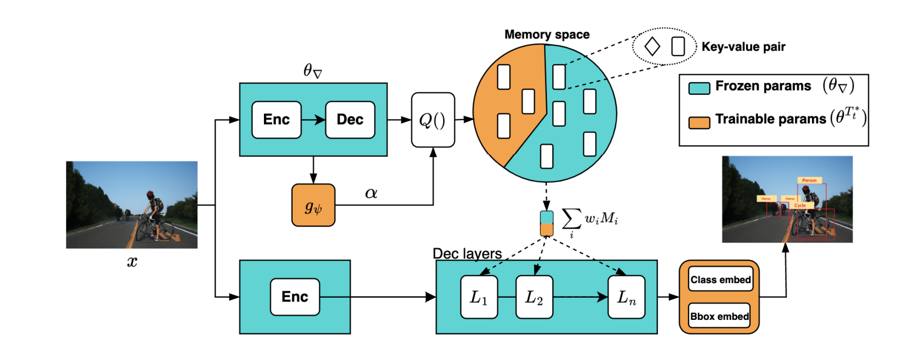

# MD-DETR
Memory-augmented Continual Detection Transformers (accepted in ECCV'24)

[](https://www.ecva.net/papers/eccv_2024/papers_ECCV/papers/11330.pdf)


<p align="center">
    
</p>

> **[Preventing Catastrophic Forgetting through
Memory Networks in Continuous Detection](https://arxiv.org/pdf/2403.14797)**<br>
> [Gaurav Bhatt*](https://gauravbh1010tt.github.io/), 
[James Ross](https://www.jamesross.xyz/),
[Leonid Sigal](https://www.cs.ubc.ca/~lsigal/)
<br>

> $Abstract$. Modern pre-trained architectures struggle to retain previous
information while undergoing continuous fine-tuning on new tasks. Despite notable progress in continual classification, systems designed for
complex vision tasks such as detection or segmentation still struggle to
attain satisfactory performance. In this work, we introduce a memorybased detection transformer architecture to adapt a pre-trained DETRstyle detector to new tasks while preserving knowledge from previous
tasks. We propose a novel localized query function for efficient information retrieval from memory units, aiming to minimize forgetting. Furthermore, we identify a fundamental challenge in continual detection
referred to as background relegation. This arises when object categories
from earlier tasks reappear in future tasks, potentially without labels,
leading them to be implicitly treated as background. This is an inevitable issue in continual detection or segmentation. The introduced
continual optimization technique effectively tackles this challenge. Finally, we assess the performance of our proposed system on continual
detection benchmarks and demonstrate that our approach surpasses the
performance of existing state-of-the-art resulting in 5-7% improvements
on MS-COCO and PASCAL-VOC on the task of continual detection.

## Outline

- [MD-DETR](#mddetr)
  - [Outline](#outline)
  - [Installation](#installation)
  - [Data Preparation](#data-preparation)
  - [Training MD-DETR](#training-mddetr)
  - [Evaluation](#evaluation)
  - [Citation](#citation)


## Installation
The code has been tested with the packages provided in the `requirement.txt` on Cuda 11.3 and Pytorch 1.12.1, etc. I have used `pip freeze > requirement.txt` to dump all the dependencies.

## Data Preparation

For MSCOCO provide the path to train, validation and annotation folder in the `run.sh` file. For quick pre-processing I have dumped all the annotation which can be downloaded from this link: [saved checkpoints](https://drive.google.com/file/d/1FZW7HfxkftAqwkmDBa5CmxxVhpxWxJDK/view?usp=sharing) (the link also contains checkpoints, logs, validation detection samples). The folder that would be needed for training is `upload/mscoco/` present in the uploaded folder. The `task_ann_dir` flag in `run.sh` should point to this folder.

```bash 
$ pip install gdown
$ gdown 1FZW7HfxkftAqwkmDBa5CmxxVhpxWxJDK
```

## Training MD-DETR

Set the flags in the `run.sh` file. The `train` flag should be 1.

```bash
$ bash run.sh
```

## Evaluation
Set the flags and paths in the `run.sh` file. The `train` flag should be 0. Make sure to download all the checkpoints provided in the link: [saved checkpoints](https://drive.google.com/file/d/1FZW7HfxkftAqwkmDBa5CmxxVhpxWxJDK/view?usp=sharing)

```bash
$ bash run.sh
```

## Citation
If you find this repo useful, please cite:
```
@article{bhatt2024preventing,
  title={Preventing Catastrophic Forgetting through Memory Networks in Continuous Detection},
  author={Bhatt, Gaurav and Ross, James and Sigal, Leonid},
  journal={In ECCV 2024},
  year={2024}
}
```


## New Run:
Run slurm schduler:
```bash
bash launch.sh -e config/experiement/validate_with_no_prompt.env -p config/sbatch/validate.sbatch.env
```
```bash
bash launch.sh -e config/experiement/validate_with_prompt.env -p config/sbatch/validate.sbatch.env
```
```bash
bash launch.sh -e config/experiement/train_with_no_promt.env -p config/sbatch/train.sbatch.env
```
```bash
bash launch.sh -e config/experiement/train_with_promt.env -p config/sbatch/train.sbatch.env
```

Directly run:
```bash
EXP=/h/stevev/MD-DETR/config/experiement/train_with_promt.env
export EXPERIMENT_CONFIG=$EXP

export EXPERIMENT_CONFIG=/h/stevev/MD-DETR/config/experiement/train_with_prompt.yaml
source config/global.env
bash run_mm.sh

python run.py -m sbatch=train_sbatch hydra/launcher=slurm hydra.verbose=true

```